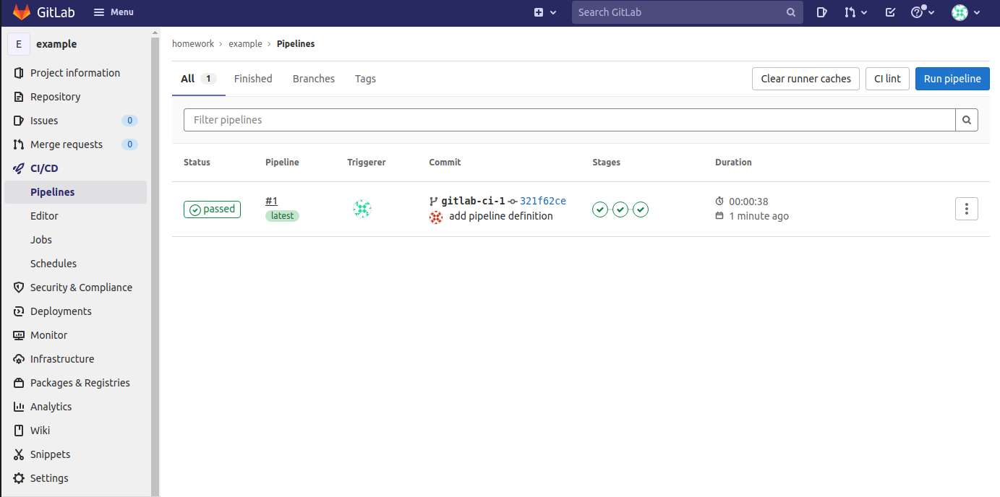
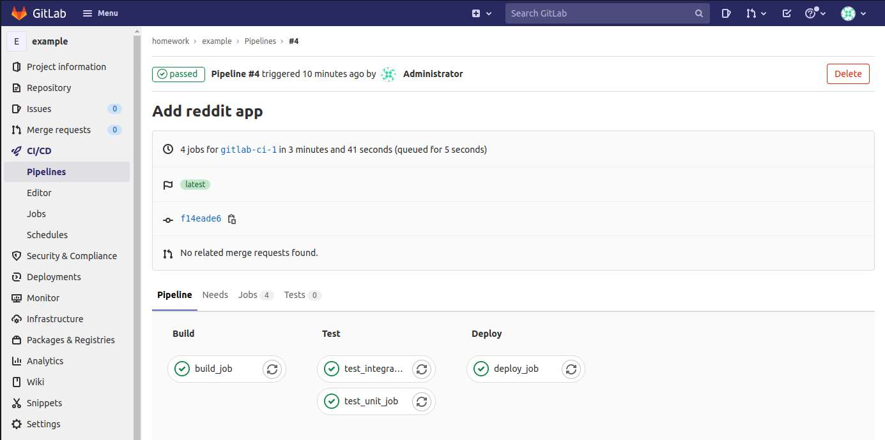
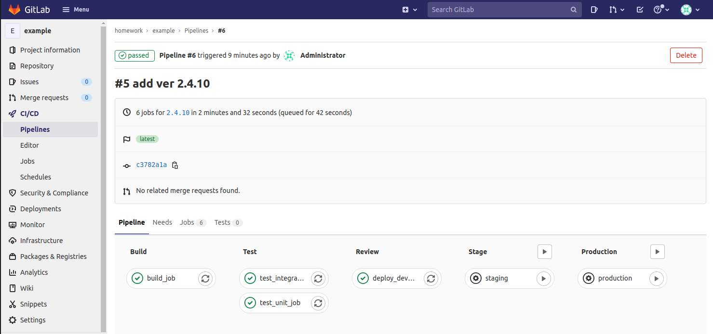
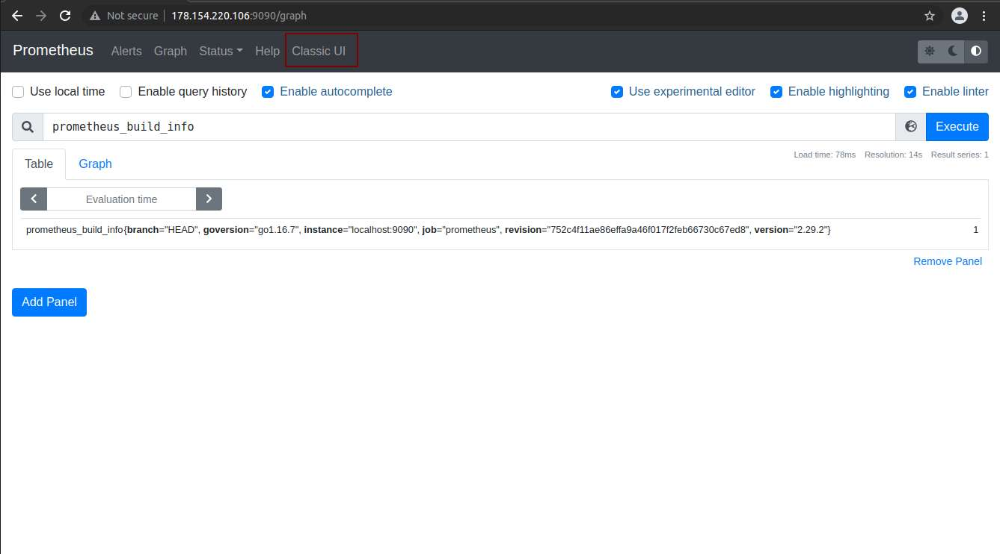
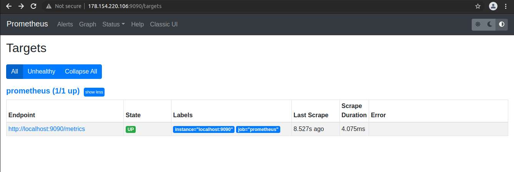
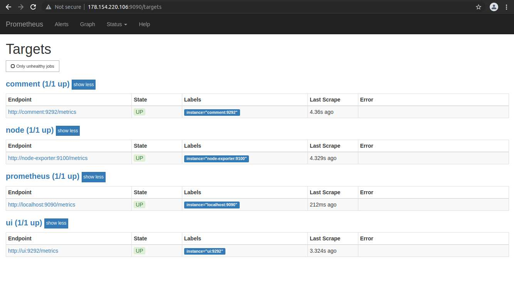
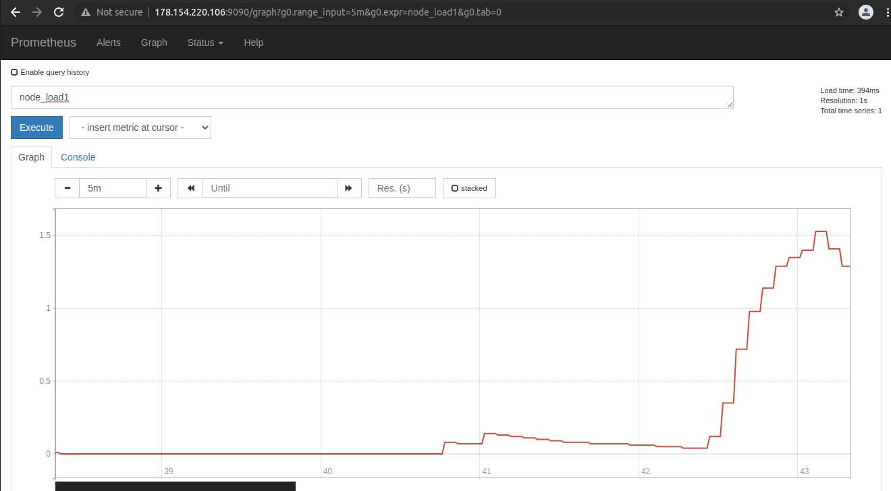
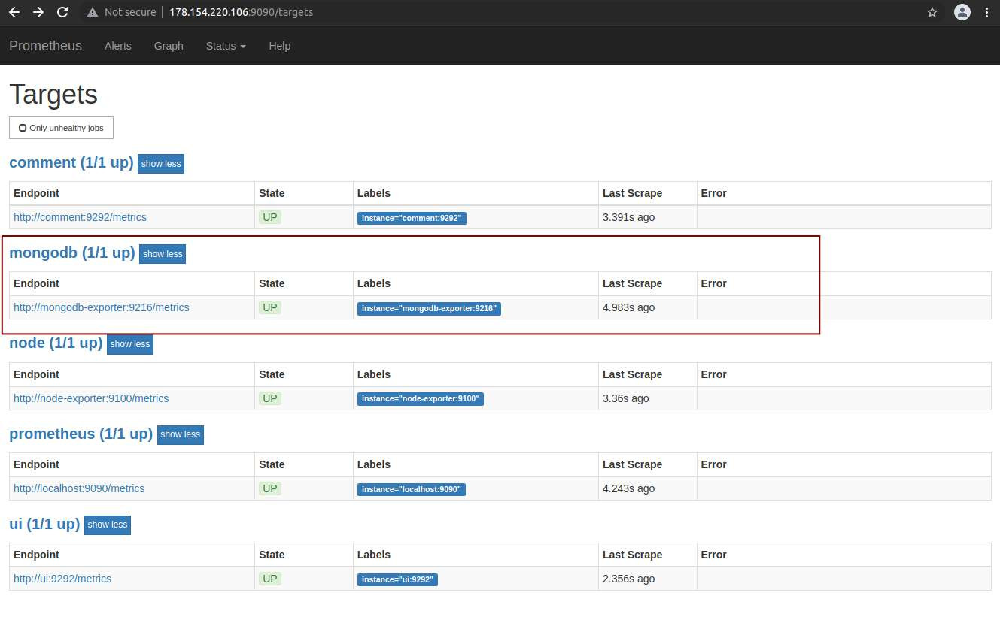
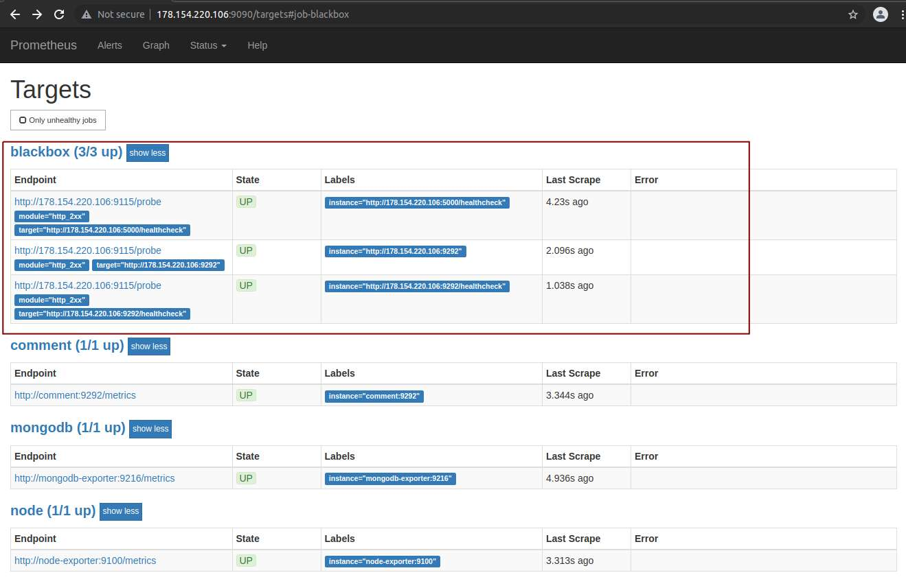
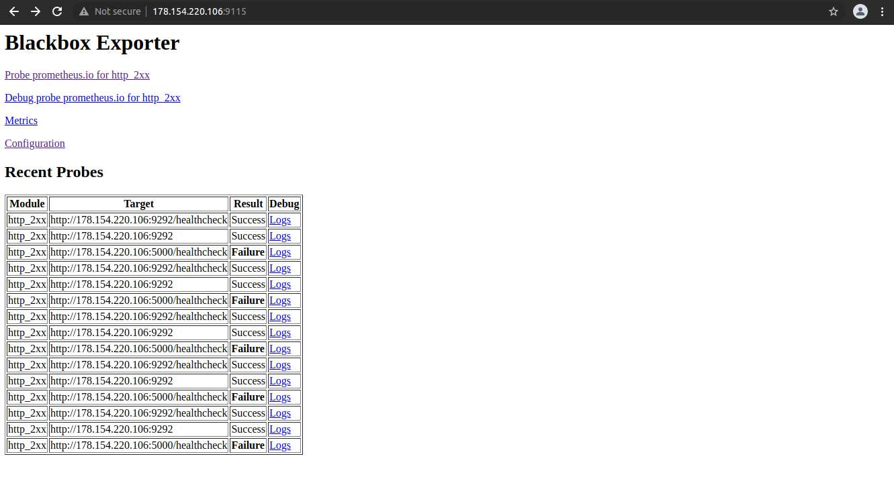

# airmeno_microservices
airmeno microservices repository

## Docker - 2 

<details>
  <summary>Решение</summary>
Установка Docker на хост - https://docs.docker.com/engine/install/ubuntu/

```
docker version
docker info
```

Команды Docker | Значение
------| ---------
docker run hello-world | Запустить контейнер
docker ps | Список запущенных контейнеров
docker ps -a | Список всех контейнеров
docker images | Список сохранненных образов
docker run -it ubuntu:18.04 /bin/bash | Запуск контейнера Ubuntu в интерактивной режиме, вход в контенер в bash
docker exec -it <u_container_id> bash | Вход в запущенный контейнер c id в bash
docker commit <u_container_id> airmeno/ubuntu-tmp-file | Создание собственного образа (image) из контейнера 
docker rm -v $(docker ps -aq -f status=exited) | Удаление остановленных контейнеров
docker rmi name |  Удаление образа
docker rmi $(docker images -q) --force | Удаление существующих образов полученных на хост
docker system df | Дискового пространства образов

### Создаем Docker machine

```
yc compute instance create \
  --name docker-host \
  --zone ru-central1-a \
  --network-interface subnet-name=default-ru-central1-a,nat-ip-version=ipv4 \
  --create-boot-disk image-folder-id=standard-images,image-family=ubuntu-1804-lts,size=15 \
  --ssh-key ~/.ssh/appuser.pub
```
```
docker-machine create \
  --driver generic \
  --generic-ip-address=84.252.130.86 \
  --generic-ssh-user yc-user \
  --generic-ssh-key ~/.ssh/appuser \
  docker-host
```
Проверим:

```
docker-machine ls

NAME          ACTIVE   DRIVER    STATE     URL                        SWARM   DOCKER     ERRORS
docker-host   -        generic   Running   tcp://84.252.130.86:2376           v20.10.7   
```
Переключим docker на удаленный хост:

```
eval $(docker-machine env docker-host)
```
> Отключаемся от окружения docker - eval $(docker-machine env --unset)

Соберем структуру файлов с требуемым содержанием и соберем образ и запусим наш контейнер из нашего образа:

```
docker build -t reddit:latest .
docker run --name reddit -d --network=host reddit:latest
```
Проверим:

```
docker-machine ls

NAME          ACTIVE   DRIVER    STATE     URL                        SWARM   DOCKER     ERRORS
docker-host   *        generic   Running   tcp://84.252.130.86:2376           v20.10.7 
```
Перейдем по адресу - http://84.252.130.86:9292

### Docker hub

Отправляем наш образ в docker репозиторий:

```
docker login

docker tag reddit:latest airmeno/otus-reddit:1.0
docker push airmeno/otus-reddit:1.0
```

Проверим:

```
docker run --name reddit -d -p 9292:9292 airmeno/otus-reddit:1.0
```

Удалим ресурсы:

```
docker-machine rm docker-host
yc compute instance delete docker-host
```

### Задания со ⭐

1. [docker-1.log](dockermonolit/docker-1.log)

2. Создаем в [docker-monolith/infra/](docker-monolith/infra/) аналогичную иерархию ветки `infra`.

При создании образа из Packer выполняется установка docker в образ c помощью плейбука `docker_install.yml`.

В Terraform количество создаваемых инстансов задается через переменную в `instance_count` в `terraform.tfvars`. 
Terraform генерирует на основе шаблона файл inventoy.ini для Ansible. 

Для запуска контейнера в инстансах в директории `ansible` запустить:
```
ansible-playbook playbooks/docker_run.yml
```

</details>

## Docker - 3

<details>
  <summary>Решение</summary>

Поднимаем ранее созданный docker host:

```
yc compute instance create \
  --name docker-host \
  --zone ru-central1-a \
  --network-interface subnet-name=default-ru-central1-a,nat-ip-version=ipv4 \
  --create-boot-disk image-folder-id=standard-images,image-family=ubuntu-1804-lts,size=15 \
  --ssh-key ~/.ssh/appuser.pub


docker-machine create \
  --driver generic \
  --generic-ip-address=84.201.159.37 \
  --generic-ssh-user yc-user \
  --generic-ssh-key ~/.ssh/appuser \
  docker-host


docker-machine ls
NAME          ACTIVE   DRIVER    STATE     URL                        SWARM   DOCKER     ERRORS
docker-host   -        generic   Running   tcp://84.201.159.37:2376           v20.10.8   


eval $(docker-machine env docker-host)
```

Скачиваем архив, распаковываем, удалем архив, переименовываем каталог и приводим файлы в требуемый вид.

Сборка приложения:

```
docker pull mongo:latest

docker build -t airmeno/post:1.0 ./post-py
docker build -t airmeno/comment:1.0 ./comment
docker build -t airmeno/ui:1.0 ./ui
```

Проверим наши образы:

```
docker images
```

Создаем специальную сеть для нашего приложения и проверим:

```
docker network create reddit

docker network ls 
```

Создаем бридж и запускаем контейнеры:

```
docker run -d --network=reddit --network-alias=post_db --network-alias=comment_db mongo:latest

docker run -d --network=reddit --network-alias=post airmeno/post:1.0
docker run -d --network=reddit --network-alias=comment airmeno/comment:1.0
docker run -d --network=reddit -p 9292:9292 airmeno/ui:1.0
```

### Задания со ⭐ (1)

Запуск контенеров с другими алиасами и передача данных с помощью переменных:

```
docker run -d --network=reddit --network-alias=my_post_db --network-alias=my_comment_db mongo:latest

docker run -d --network=reddit --network-alias=my_post --env POST_DATABASE_HOST=my_post_db airmeno/post:1.0
docker run -d --network=reddit --network-alias=my_comment --env COMMENT_DATABASE_HOST=my_comment_db  airmeno/comment:1.0
docker run -d --network=reddit -p 9292:9292 --env POST_SERVICE_HOST=my_post --env COMMENT_SERVICE_HOST=my_comment airmeno/ui:1.0
```

Были заданы алиасам название с `my_`  с переопределением перемнных `ENV` чрез ключ `--env`.

### Сервис ui - улучшаем образ

Посмотрим размер нашего образа `ui`:

```
docker images

REPOSITORY        TAG            IMAGE ID       CREATED          SIZE
airmeno/ui        1.0            3e640e60b8e3   30 minutes ago   771MB
```

Поменяем содержимое ./ui/Dockerfile:

```
FROM ubuntu:16.04
RUN apt-get update \
    && apt-get install -y ruby-full ruby-dev build-essential \
    && gem install bundler --no-ri --no-rdoc

ENV APP_HOME /app
RUN mkdir $APP_HOME

WORKDIR $APP_HOME
ADD Gemfile* $APP_HOME/
RUN bundle install
ADD . $APP_HOME

ENV POST_SERVICE_HOST post
ENV POST_SERVICE_PORT 5000
ENV COMMENT_SERVICE_HOST comment
ENV COMMENT_SERVICE_PORT 9292

CMD ["puma"]
```

и пересоберем:

```
docker build -t airmeno/ui:2.0 ./ui
```

Проверим еще раз:

```
docker images

REPOSITORY        TAG            IMAGE ID       CREATED          SIZE
airmeno/ui        2.0            467ce10db702   24 seconds ago   462MB
airmeno/ui        1.0            3e640e60b8e3   36 minutes ago   771MB
```

Запустим еще раз наши контейнеры:

```
docker kill $(docker ps -q)
docker run -d --network=reddit --network-alias=post_db --network-alias=comment_db mongo:latest

docker run -d --network=reddit --network-alias=post airmeno/post:1.0
docker run -d --network=reddit --network-alias=comment airmeno/comment:1.0
docker run -d --network=reddit -p 9292:9292 airmeno/ui:2.0
```

### Создадим Docker volume

```
docker volume create reddit_db
```
Подключим его к контейнеру с MongoDB:

```
docker kill $(docker ps -q)
docker run -d --network=reddit --network-alias=post_db --network-alias=comment_db -v reddit_db:/data/db mongo:latest

docker run -d --network=reddit --network-alias=post airmeno/post:1.0
docker run -d --network=reddit --network-alias=comment airmeno/comment:1.0
docker run -d --network=reddit -p 9292:9292 airmeno/ui:2.0
```

### Задания со ⭐ (2)

Cобрать образ на основе Alpine Linux. Создаем [Dockerfile.1](src/ui/Dockerfile.1), в качестве базового образа берем Alpine Linux 3.14.
Для уменьшения размера образа используем `--no-cache` и после установки пакетов принудительно еще очищаем `rm -rf /var/cache/apk/*`.

Сборка нашего образа:

```
docker build -t airmeno/ui:3.0 ./ui --file ui/Dockerfile.1
```

Проверим еще раз размер образа:

```
docker images

REPOSITORY        TAG            IMAGE ID       CREATED          SIZE
airmeno/ui        3.0            f93530e5970f   35 seconds ago       265MB
airmeno/ui        2.0            467ce10db702   About an hour ago    462MB
airmeno/ui        1.0            3e640e60b8e3   About an hour ago    771MB
```

и проверим что наш образ рабочий:

```
docker kill $(docker ps -q)
docker run -d --network=reddit --network-alias=post_db --network-alias=comment_db -v reddit_db:/data/db mongo:latest

docker run -d --network=reddit --network-alias=post airmeno/post:1.0
docker run -d --network=reddit --network-alias=comment airmeno/comment:1.0
docker run -d --network=reddit -p 9292:9292 airmeno/ui:3.0
```

Удалим ресурсы:
```
docker-machine rm docker-host
yc compute instance delete docker-host
```
</details>

## Docker - 4

<details>
  <summary>Решение</summary>
Поднимаем docker host:

```
yc compute instance create \
  --name docker-host \
  --zone ru-central1-a \
  --network-interface subnet-name=default-ru-central1-a,nat-ip-version=ipv4 \
  --create-boot-disk image-folder-id=standard-images,image-family=ubuntu-1804-lts,size=15 \
  --ssh-key ~/.ssh/appuser.pub


docker-machine create \
  --driver generic \
  --generic-ip-address=84.252.130.206 \
  --generic-ssh-user yc-user \
  --generic-ssh-key ~/.ssh/appuser \
  docker-host


docker-machine ls
NAME          ACTIVE   DRIVER    STATE     URL                        SWARM   DOCKER     ERRORS
docker-host   -        generic   Running   tcp://84.252.130.206:2376           v20.10.8   


eval $(docker-machine env docker-host)
```

### Docker Network Drivers (Native)

* none - в контейнере есть только loopback интерфейс
* host - контейнеры видят только хостовувю сеть 
* bridge - контейнеры могу общаться через сеть и выходить наружу через хостовую сеть 

Запустим контейнеры с использованием драйверов сети с ключами --network: <none>, <host>, <bridge>

В качестве образа используем joffotron/docker-net-tools с сетевыми утилитами: bindtools, net-tools и curl.

```
docker run -ti --rm --network none joffotron/docker-net-tools -c ifconfig

lo        Link encap:Local Loopback  
          inet addr:127.0.0.1  Mask:255.0.0.0
          UP LOOPBACK RUNNING  MTU:65536  Metric:1
          RX packets:0 errors:0 dropped:0 overruns:0 frame:0
          TX packets:0 errors:0 dropped:0 overruns:0 carrier:0
          collisions:0 txqueuelen:1000 
          RX bytes:0 (0.0 B)  TX bytes:0 (0.0 B)
```

Вывод команды `docker-machine ssh docker-host ifconfig` бедет идентичен выводу `docker run -ti --rm --network host joffotron/docker-net-tools -c ifconfig`

```
docker run -ti --rm --network host joffotron/docker-net-tools -c ifconfig

docker0   Link encap:Ethernet  HWaddr 02:42:2C:69:21:67  
          inet addr:172.17.0.1  Bcast:172.17.255.255  Mask:255.255.0.0
          UP BROADCAST MULTICAST  MTU:1500  Metric:1
          RX packets:0 errors:0 dropped:0 overruns:0 frame:0
          TX packets:0 errors:0 dropped:0 overruns:0 carrier:0
          collisions:0 txqueuelen:0 
          RX bytes:0 (0.0 B)  TX bytes:0 (0.0 B)

eth0      Link encap:Ethernet  HWaddr D0:0D:17:CA:5D:E8  
          inet addr:10.128.0.7  Bcast:10.128.0.255  Mask:255.255.255.0
          inet6 addr: fe80::d20d:17ff:feca:5de8%32666/64 Scope:Link
          UP BROADCAST RUNNING MULTICAST  MTU:1500  Metric:1
          RX packets:10530 errors:0 dropped:0 overruns:0 frame:0
          TX packets:6844 errors:0 dropped:0 overruns:0 carrier:0
          collisions:0 txqueuelen:1000 
          RX bytes:117913818 (112.4 MiB)  TX bytes:606323 (592.1 KiB)

lo        Link encap:Local Loopback  
          inet addr:127.0.0.1  Mask:255.0.0.0
          inet6 addr: ::1%32666/128 Scope:Host
          UP LOOPBACK RUNNING  MTU:65536  Metric:1
          RX packets:282 errors:0 dropped:0 overruns:0 frame:0
          TX packets:282 errors:0 dropped:0 overruns:0 carrier:0
          collisions:0 txqueuelen:1000 
          RX bytes:25622 (25.0 KiB)  TX bytes:25622 (25.0 KiB)
```

```
docker run -ti --rm --network bridge joffotron/docker-net-tools -c ifconfig

eth0      Link encap:Ethernet  HWaddr 02:42:AC:11:00:02  
          inet addr:172.17.0.2  Bcast:172.17.255.255  Mask:255.255.0.0
          UP BROADCAST RUNNING MULTICAST  MTU:1500  Metric:1
          RX packets:2 errors:0 dropped:0 overruns:0 frame:0
          TX packets:0 errors:0 dropped:0 overruns:0 carrier:0
          collisions:0 txqueuelen:0 
          RX bytes:180 (180.0 B)  TX bytes:0 (0.0 B)

lo        Link encap:Local Loopback  
          inet addr:127.0.0.1  Mask:255.0.0.0
          UP LOOPBACK RUNNING  MTU:65536  Metric:1
          RX packets:0 errors:0 dropped:0 overruns:0 frame:0
          TX packets:0 errors:0 dropped:0 overruns:0 carrier:0
          collisions:0 txqueuelen:1000 
          RX bytes:0 (0.0 B)  TX bytes:0 (0.0 B)
```

### Network namespaces

Запустим несколько раз (в моем случае 3 раза) команду `docker run --network host -d nginx`. Проверим наши контейнеры:

```
docker ps

CONTAINER ID   IMAGE     COMMAND                  CREATED          STATUS          PORTS     NAMES
c8de1eb525ef   nginx     "/docker-entrypoint.…"   28 seconds ago   Up 25 seconds             flamboyant_swirles

docker ps -a
CONTAINER ID   IMAGE     COMMAND                  CREATED              STATUS                          PORTS     NAMES
35b31a75d59d   nginx     "/docker-entrypoint.…"   About a minute ago   Exited (1) About a minute ago             boring_bhaskara
76a8c0484020   nginx     "/docker-entrypoint.…"   About a minute ago   Exited (1) About a minute ago             jolly_thompson
c8de1eb525ef   nginx     "/docker-entrypoint.…"   2 minutes ago        Up About a minute                         flamboyant_swirles
```

Как видно из вывода, работает только один контейнер. Это связано с Host Driver:
- Контейнер использует network namespace хоста;
- Сеть не управляется самим Docker;
- Два сервиса в разных контейнерах не могут слушать один и тот же порт.

Подготовим хостовую машину для просмотра net-namespaces:

```
docker-machine ssh docker-host

sudo ln -s /var/run/docker/netns /var/run/netns
```

Теперь можно просматривать существующие network namespases: 
```
sudo ip netns 

default
```


Создадим docker-сети:
```
docker network create back_net --subnet=10.0.2.0/24
docker network create front_net --subnet=10.0.1.0/24
```

Запустим контейнеры:
```
docker build -t airmeno/post:1.0 ./post-py
docker build -t airmeno/comment:1.0 ./comment
docker build -t airmeno/ui:1.0 ./ui

docker run -d --network=front_net -p 9292:9292 --name ui airmeno/ui:1.0
docker run -d --network=back_net --name comment airmeno/comment:1.0
docker run -d --network=back_net --name post airmeno/post:1.0
docker run -d --network=back_net --name mongo_db --network-alias=post_db --network-alias=comment_db mongo:latest 
``` 

Docker при инициализации контейнера может подключить к нему только одну сеть. Дополнительные сети подключаются командой:
`docker network connect <network> <container>`

Подключим контейнеры ко второй сети:
```
docker network connect front_net post
docker network connect front_net comment
```

Заглянем внутрь сетей docker:

```
# Подключимся к докер хосту и установим утилиты для работы с бриджами
docker-machine ssh docker-host
sudo apt-get update && sudo apt-get install bridge-utils net-tools

sudo docker network ls

NETWORK ID     NAME        DRIVER    SCOPE
e49658e1166a   back_net    bridge    local
c6ce64b8682e   bridge      bridge    local
532d2c1a27d8   front_net   bridge    local
51ecc8068029   host        host      local
c4e2385e38fa   none        null      local

# созданные в рамках проекта сети
ifconfig | grep br

ifconfig | grep br
br-532d2c1a27d8: flags=4163<UP,BROADCAST,RUNNING,MULTICAST>  mtu 1500
        inet 10.0.1.1  netmask 255.255.255.0  broadcast 10.0.1.255
br-e49658e1166a: flags=4163<UP,BROADCAST,RUNNING,MULTICAST>  mtu 1500
        inet 10.0.2.1  netmask 255.255.255.0  broadcast 10.0.2.255
        inet 172.17.0.1  netmask 255.255.0.0  broadcast 172.17.255.255
        inet 10.128.0.7  netmask 255.255.255.0  broadcast 10.128.0.255

# Посмотрим какие интерфейсы есть в бридже
brctl show br-532d2c1a27d8

bridge name     bridge id               STP enabled     interfaces
br-532d2c1a27d8         8000.0242a651061f       no      veth1fccfd0
                                                        veth542d6b7
                                                        vethbc04562

# Посмотрим как выглядит iptables
sudo iptables -nL -t nat

...
Chain POSTROUTING (policy ACCEPT)
target     prot opt source               destination         
MASQUERADE  all  --  10.0.1.0/24          0.0.0.0/0           
MASQUERADE  all  --  10.0.2.0/24          0.0.0.0/0           
MASQUERADE  all  --  172.17.0.0/16        0.0.0.0/0           
MASQUERADE  tcp  --  10.0.1.2             10.0.1.2             tcp dpt:9292
...
DNAT       tcp  --  0.0.0.0/0            0.0.0.0/0            tcp dpt:9292 to:10.0.1.2:9292

# проверим работу docker-proxy
ps ax | grep docker-proxy

19166 ?        Sl     0:00 /usr/bin/docker-proxy -proto tcp -host-ip 0.0.0.0 -host-port 9292 -container-ip 10.0.1.2 -container-port 9292
19173 ?        Sl     0:00 /usr/bin/docker-proxy -proto tcp -host-ip :: -host-port 9292 -container-ip 10.0.1.2 -container-port 9292
```

### Docker-compose

Docker-compose - это инструментальное средство взаимодействия контейнеров, docker сетей, хранилищ (volume). Удобен когда:
- Одно приложение состоит из множества контейнеров / сервисов
- Один контейнер зависит от другого
- Порядок запуска имеет значение
- docker build/run/create

Проверим установку:
```
docker-compose -v

docker-compose version 1.29.2, build 5becea4c
```

Остановим запущенные контейнеры:

```
docker kill $(docker ps -q)
```

Запустим docker-compose:

```
export USERNAME=airmeno
docker-compose up -d
```

Проверим:
```
docker-compose ps

    Name                  Command             State                    Ports                  
----------------------------------------------------------------------------------------------
src_comment_1   puma                          Up                                              
src_post_1      python3 post_app.py           Up                                              
src_post_db_1   docker-entrypoint.sh mongod   Up      27017/tcp                               
src_ui_1        puma                          Up      0.0.0.0:9292->9292/tcp,:::9292->9292/tcp
```

Параметризируем наш docker-compose.yml, переменные перенесем в `.env`, создадим алиасы сетей.

Зададим имя проекту, по умолчанию имя (префикс) формируется от имени каталога где находится проект, в нашем случае `src`. Для смены префикса можно запустить проект:

```
docker-compose -p project-name up -d
```

или задать переменную в `.env`: `COMPOSE_PROJECT_NAME=project-name`

### Задания со ⭐

- Изменять код каждого из приложений, не выполняя сборку образа 
- Запускать puma для руби приложений в дебаг режиме с двумя воркерами (флаги --debug и -w 2)

По умолчанию Compose читает два файла: `docker-compose.yml` и необязательный файл `docker-compose.override.yml`. `docker-compose.yml` содержит базовую конфигурацию. Файл `docker-compose.override.yml` может содержать переопределения конфигурации для существующих служб или полностью новых служб.

> https://docs.docker.com/compose/extends/

Создаем `docker-compose.override.yml` файл:

```
version: '3.3'
services:

  ui:
    volumes:
      - ./ui:/app
    command: puma --debug -w 2

  post:
    volumes:
      - ./post-py:/app
      
  comment:
    volumes:
      - ./comment:/app
    command: puma --debug -w 2
```

Переопределили запуск `puma` и смонтировали каталоги кодов контейнеров в `/app`.

> Поскольку монтирование происходит на локальном хосте, сборку compose придется делать на локальной машине, иначе придется переносить каталоги проекта на docker host.

```
# остановим compose
docker-compose down 

# переключимся на локальный хост
eval $(docker-machine env --unset)

# запуск со сборкой всех контейнеров
sudo docker-compose up -d

# проверка 
sudo docker-compose ps

    Name                  Command             State                    Ports                  
----------------------------------------------------------------------------------------------
src_comment_1   puma --debug -w 2             Up                                              
src_post_1      python3 post_app.py           Up                                              
src_post_db_1   docker-entrypoint.sh mongod   Up      27017/tcp                               
src_ui_1        puma --debug -w 2             Up      0.0.0.0:9292->9292/tcp,:::9292->9292/tcp
```

Проверим, что контейнеры запустились с нужным ключом:

```
sudo docker ps

CONTAINER ID   IMAGE                 COMMAND                  CREATED         STATUS         PORTS                                       NAMES
61789df19d1b   airmeno/ui:1.0        "puma --debug -w 2"      9 seconds ago   Up 7 seconds   0.0.0.0:9292->9292/tcp, :::9292->9292/tcp   src_ui_1
d53984fe89fd   airmeno/post:1.0      "python3 post_app.py"    9 seconds ago   Up 7 seconds                                               src_post_1
b97db9c8603b   mongo:3.2             "docker-entrypoint.s…"   9 seconds ago   Up 7 seconds   27017/tcp                                   src_post_db_1
7652c547b197   airmeno/comment:1.0   "puma --debug -w 2"      9 seconds ago   Up 7 seconds                                               src_comment_1
```

Наш проект должен быть доступен по http://localhost:9292

Попробуем отредактировать файлы проекта:

```
touch src/comment/testfile
sudo docker-compose exec comment ls -l ../app

total 32
-rw-rw-r-- 1 1000 1000  420 Aug  6 16:43 Dockerfile
-rw-rw-r-- 1 1000 1000  182 Aug  6 16:43 Gemfile
-rw-rw-r-- 1 1000 1000  919 Aug  6 16:43 Gemfile.lock
-rw-rw-r-- 1 1000 1000    6 Aug  6 16:43 VERSION
-rw-rw-r-- 1 1000 1000 3910 Aug  6 16:43 comment_app.rb
-rw-rw-r-- 1 1000 1000  304 Aug  6 16:43 config.ru
-rw-rw-r-- 1 1000 1000  170 Aug  6 16:43 docker_build.sh
-rw-rw-r-- 1 1000 1000 1809 Aug  6 16:43 helpers.rb
-rw-rw-r-- 1 1000 1000    0 Aug  6 20:40 testfile
```
Наш файл пристуствует. Таким образом можем редактировать файлы пректа не выполняя сборку образа. Удалим созданный файл `testfile` и убедимся, что и в контейнере он удалился.

Удалим ресурсы:
```
sudo docker-compose down
docker-machine rm docker-host
yc compute instance delete docker-host
```

</details>


## Gitlab CI

<details>
  <summary>Решение</summary>
Создаем ветку в репозитории:

```
git checkout -b gitlab-ci-1
```

Поднимаем docker host:

```
yc compute instance create \
  --name gitlab-host \
  --memory=4 \
  --zone ru-central1-a \
  --network-interface subnet-name=default-ru-central1-a,nat-ip-version=ipv4 \
  --create-boot-disk image-folder-id=standard-images,image-family=ubuntu-1804-lts,size=50 \
  --ssh-key ~/.ssh/appuser.pub
```

Установим docker и docker-compose

```
cd gitlab-ci/ansible/
ansible-playbook docker_playbook.yml
```

### Установка GitLab-CE

Подключимся к хосту и создадим необходимые каталоги:

```
ssh yc-user@178.154.223.64
sudo mkdir -p /srv/gitlab/config /srv/gitlab/data /srv/gitlab/logs

cd /srv/gitlab
sudo touch docker-compose.yml
```

```
sudo vim docker-compose.yml

web:
  image: 'gitlab/gitlab-ce:latest'
  restart: always
  hostname: 'localhost'
  environment:
    GITLAB_OMNIBUS_CONFIG:
      external_url 'http://178.154.223.64'
  ports:
    - '80:80'
    - '443:443'
    - '2222:22'
  volumes:
    - '/srv/gitlab/config:/etc/gitlab'
    - '/srv/gitlab/logs:/var/log/gitlab'
    - '/srv/gitlab/data:/var/opt/gitlab'
```

> https://docs.gitlab.com/ee/install/docker.html


Запустим gitlab через docker-compose:

```
sudo docker-compose up -d
```
и проверим доступность: http://178.154.223.64

> на запуск служб и компонентов внутри контейнера gitlab ждем пару минут.

Пароль рута не получилось сменить, поэтому была применина методика сброса пароля: `touch /etc/gitlab/initial_root_password`, в случае с контенером:

```
sudo touch /srv/gitlab/config/initial_root_password

sudo cat /srv/gitlab/config/initial_root_password
```

берем значение пароль и используем его для пользоватля `root`.

### Настройки

1. Отключаем регистрацию новых пользователей:

```
Settings -> General -> Sign-up restrictions 

[ ] Sign-up enabled
```
2. Создаем группу: 
* Name - homework
* Description - Projects for my homework
* Visibility - private

3. Создаем проект: `example`

Для выполнения push с локального хоста в gitlab выполним (Добавление remote):

```
git remote add gitlab http://178.154.223.64/homework/example.git
git push gitlab gitlab-ci-1
```
4. Пайплайн для GitLab определяется в файле `.gitlab-ci.yml`

```
stages:
  - build
  - test
  - deploy

build_job:
  stage: build
  script:
    - echo 'Building'

test_unit_job:
  stage: test
  script:
    - echo 'Testing 1'

test_integration_job:
  stage: test
  script:
    - echo 'Testing 2'

deploy_job:
  stage: deploy
  script:
    - echo 'Deploy'
```

Запушим изменения:
```
git add .gitlab-ci.yml
git commit -m 'add pipeline definition'
git push gitlab gitlab-ci-1
```

5. Добавление раннера

На сервере Gitlab CI, выполним:

```
ssh yc-user@178.154.223.64

sudo docker run -d --name gitlab-runner --restart always -v /srv/gitlabrunner/config:/etc/gitlab-runner -v /var/run/docker.sock:/var/run/docker.sock gitlab/gitlab-runner:latest
```

Регистрация раннера (указываем url сервера gitlab и токен из `Settings -> CI/CD -> Pipelines -> Runners `):

```
sudo docker exec -it gitlab-runner gitlab-runner register \
 --url http://178.154.223.64/ \
 --non-interactive \
 --locked=false \
 --name DockerRunner \
 --executor docker \
 --docker-image alpine:latest \
 --registration-token R1mGR3J-C8T74Xsa_FfZ \
 --tag-list "linux,xenial,ubuntu,docker" \
 --run-untagged
```

Если все успешно, то должен появится новый ранер в `Settings -> CI/CD -> Pipelines -> Runners ` секция `Available specific runners` и после появления ранера должен выполнится пайплайн.



6. Добавление Reddit в проект

```
git clone https://github.com/express42/reddit.git && rm -rf ./reddit/.git
git add reddit/
git commit -m "Add reddit app"
git push gitlab gitlab-ci-1
```
Измените описание пайплайна в `.gitlab-ci.yml`, создаем файл тестов `reddit/simpletest.rb`:

```
require_relative './app'
require 'test/unit'
require 'rack/test'

set :environment, :test

class MyAppTest < Test::Unit::TestCase
  include Rack::Test::Methods

  def app
    Sinatra::Application
  end

  def test_get_request
    get '/'
    assert last_response.ok?
  end
end
```

Добавим библиотеку `rack-test` в `reddit/Gemfile`:

```
gem 'rack-test'
```

Запушим код в GitLab и убедимся, что test_unit_job гоняет тесты.



7. Окружения

Добавим в `.gitlab-ci.yml` новые окружения и условия запусков для ранеров 

```
image: ruby:2.4.2

stages:
  - build
  - test
  - review
  - stage
  - production

variables:
  DATABASE_URL: 'mongodb://mongo/user_posts'
   
before_script:
  - cd reddit
  - bundle install

build_job:
  stage: build
  script:
    - echo 'Building'

test_unit_job:
  stage: test
  services:
    - mongo:latest
  script:
    - ruby simpletest.rb

test_integration_job:
  stage: test
  script:
    - echo 'Testing 2'

deploy_dev_job:
  stage: review
  script:
    - echo 'Deploy'
  environment:
    name: dev
    url: http://dev.example.com

branch review:
  stage: review
  script: echo "Deploy to $CI_ENVIRONMENT_SLUG"
  environment:
    name: branch/$CI_COMMIT_REF_NAME
    url: http://$CI_ENVIRONMENT_SLUG.example.com
  only:
    - branches
  except:
    - master

staging:
  stage: stage
  when: manual
  only:
    - /^\d+\.\d+\.\d+/
  script:
    - echo 'Deploy'
  environment:
    name: stage
    url: http://beta.example.com

production:
  stage: production
  when: manual
  only:
    - /^\d+\.\d+\.\d+/
  script:
    - echo 'Deploy'
  environment:
    name: production
    url: http://example.com

```

где:
* `when: manual` - определяет ручной запуск
* Директива `only` описывает условия, которые должны быть `истина`: регулярное выражение `/^\d+\.\d+\.\d+/` означает, что в git должен стоять тег из цифр разделенных точками (например 2.4.6). Изменения без указания тэга запустят пайплайн без задач staging и production.
* `branch review:` на каждую ветку в git, отличную от master, Gitlab CI будет определять новое окружение.

Для проверки закоммитим файлы с указанием тэга (версии) и запушим в gitlab:

```
git add .gitlab-ci.yml
git commit -m '#5 add ver 2.4.10'
git tag 2.4.10
git push gitlab gitlab-ci-1 --tags
```



Stage и Production окружения запускаются вручную


### Задания со ⭐: Настройка оповещений в Slack

Настроено на канале devops-team-otus.slack.com
Channel ID: C024SKJK64V


### Удалим ресурсы:

```
sudo docker-compose down
yc compute instance delete gitlab-host
```
</details>

## Системы мониторинга (Prometheus)

<details>
  <summary>Решение</summary>

### Подготовка окружения

Создадим Docker хост и настроим локальное окружение:
```
yc compute instance create \
  --name docker-host \
  --memory=4 \
  --zone ru-central1-a \
  --network-interface subnet-name=default-ru-central1-a,nat-ip-version=ipv4 \
  --create-boot-disk image-folder-id=standard-images,image-family=ubuntu-1804-lts,size=15 \
  --ssh-key ~/.ssh/appuser.pub

	
docker-machine create \
  --driver generic \
  --generic-ip-address=178.154.220.106 \
  --generic-ssh-user yc-user \
  --generic-ssh-key ~/.ssh/appuser \
  docker-host
```
```
docker-machine ls
NAME          ACTIVE   DRIVER    STATE     URL                        SWARM   DOCKER     ERRORS
docker-host   -        generic   Running   tcp://178.154.220.106:2376           v20.10.8   


eval $(docker-machine env docker-host)
```

### Запуск Prometheus

Воспользуемся готовым образом с DockerHub:

```
docker run --rm -p 9090:9090 -d --name prometheus prom/prometheus

docker ps

CONTAINER ID   IMAGE             COMMAND                  CREATED          STATUS          PORTS                                       NAMES
e8854394c01d   prom/prometheus   "/bin/prometheus --c…"   15 seconds ago   Up 12 seconds   0.0.0.0:9090->9090/tcp, :::9090->9090/tcp   prometheus
```

Перейдем по адресу http://178.154.220.106:9090

> узнать адрес докер хоста можно: `docker-machine ip docker-host`



Интерфейс обновился, для перехода на старый интерфейс выбираем в меню **Clasic UI**.

**Targets**

Targets (цели) - представляют собой системы или процессы, за которыми следит Prometheus. Prometheus является pull системой, поэтому он постоянно делает HTTP запросы на имеющиеся у него адреса (endpoints). Посмотрим текущий список целей - **Status -> Targets**



В Targest сейчас мы видимо только сам Prometheus. У каждой цели есть свой список адресов (endpoints), по которым следует обращаться для получения информации.

### Структура директорий:

* Создадим директорию docker в корне репозитория и перенесем в нее директорию `docker-monolith` и файлы `docker-compose.*` и все `.env`.
* Создадим в корне репозитория директорию `monitoring`. В ней будет хранится все, что относится к мониторингу.

Установим `docker-compose` на docker хосте:
```
docker-machine ssh docker-host
sudo apt install docker-compose
```

### Мониторинг состояния микросервисов

**Создание Docker образа Prometheus**

```
cat monitoring/prometheus/Dockerfile

FROM prom/prometheus:v2.1.0
ADD prometheus.yml /etc/prometheus/
```

Конфигурация Prometheus происходит через файлы конфигурации и опции командной строки. В `monitoring/prometheus` создаем файл `prometheus.yml`:

```
---
global:
  scrape_interval: '5s'

scrape_configs:
  - job_name: 'prometheus'
    static_configs:
      - targets:
        - 'localhost:9090'

  - job_name: 'ui'
    static_configs:
      - targets:
        - 'ui:9292'

  - job_name: 'comment'
    static_configs:
      - targets:
        - 'comment:9292'
```

В директории `prometheus` собираем Docker образ:

```
export USER_NAME=username
docker build -t $USER_NAME/prometheus .
```

**Образы микросервисов**

В коде микросервисов есть healthcheck-и для проверки работоспособности приложения. 

Сборку образом теперь необходимо производить при помощи скриптов `docker_build.sh`, которые есть в директории каждого сервиса. С его помощью мы добавим информацию из Git в наш healthcheck.

```
/src/ui $ bash docker_build.sh
/src/post-py $ bash docker_build.sh
/src/comment $ bash docker_build.sh
```
Или из корня репозитория:

```
for i in ui post-py comment; do cd src/$i; bash docker_build.sh; cd -; done
```

Prometheus поднимаем совместно с микросервисами. В `docker/docker-compose.yml` опишем новый сервис:

```
services:

...

  prometheus:
    image: ${USER_NAME}/prometheus
    ports:
      - 9090:9090
    volumes:
      - prometheus_data:/prometheus
    command:
    # Передаем доп параметры вкомандной строке
      - '--config.file=/etc/prometheus/prometheus.yml'
      - '--storage.tsdb.path=/prometheus'
      - '--storage.tsdb.retention=1d' # Задаем время хранения метрик в 1 день
    networks:
      - front_net
      - back_net 
...
  
  volumes:
    prometheus_data:
```

Изменим `build` образов наших микросервисом на уже подготовленные образы через скрипт `docker_build.sh`:

```
  #build: ./ui
  #image: ${USERNAME}/ui:${UI_TAG}
    
  image: ${USER_NAME}/ui
```

Поднимаем сервисы. Поскольку в предыдущих заданиях был использован `docker-compose.override.yml`, то игнорируем его при запуске:

```
docker-compose -f docker-compose.yml up -d
```
Убедимся, что сервисы (контейнеры) поднялись:

```
docker-compose ps

       Name                      Command               State                    Ports                  
-------------------------------------------------------------------------------------------------------
docker_comment_1      puma                             Up                                              
docker_post_1         python3 post_app.py              Up                                              
docker_post_db_1      docker-entrypoint.sh mongod      Up      27017/tcp                               
docker_prometheus_1   /bin/prometheus --config.f ...   Up      0.0.0.0:9090->9090/tcp,:::9090->9090/tcp
docker_ui_1           puma                             Up      0.0.0.0:9292->9292/tcp,:::9292->9292/tcp
```

### Exporters

Экспортер похож на вспомогательного агента для сбора метрик. 

В ситуациях, когда мы не можем реализовать отдачу метрик Prometheus в коде приложения, мы можем использовать экспортер, который будет транслировать метрики приложения или системы в формате доступном для чтения Prometheus.

Для сбора информации о работе Docker хоста и представления этой информации в Prometheus воспользуемся `Node exporter`.

Определим ещё один сервиc в `docker/docker-compose.yml`:

```
node-exporter:
  image: prom/node-exporter:v0.15.2
  user: root
  volumes:
    - /proc:/host/proc:ro
    - /sys:/host/sys:ro
    - /:/rootfs:ro
  command:
    - '--path.procfs=/host/proc'
    - '--path.sysfs=/host/sys'
    - '--collector.filesystem.ignored-mount-points="^/(sys|proc|dev|host|etc)($$|/)"'  
  networks:
    - front_net
    - back_net  

```

И в `monitoring/prometheus/prometheus.yml` добавим job для `node exporter`:

```
- job_name: 'node'
  static_configs: 
    - targets: 
      - 'node-exporter:9100'
```

Соберем новый Docker образ для Prometheus:

```
cd monitoring/prometheus 

docker build -t $USER_NAME/prometheus .
```

Пересоздадим сервисы:

```
cd ../../docker/
docker-compose down
docker-compose -f docker-compose.yml up -d
```

Убедимся, что список endpoint-ов Prometheus появился ещё один endpoint - `node`.



Добавим нагрузки на Docker Host и проверм:

```
docker-machine ssh docker-host

yes > /dev/null
```



### Обазы в DockerHub

```
docker login
Login Succeeded


docker push $USER_NAME/ui
docker push $USER_NAME/comment
docker push $USER_NAME/post
docker push $USER_NAME/prometheus
```

Ссылка на DockerHub: https://hub.docker.com/u/airmeno

### Задания со ⭐

**MongoDB Exporter**

Соберем Docker образ нашего `mongodb_exporter` через `monitoring/mongodb-exporter/Dockerfile` из https://github.com/percona/mongodb_exporter:

```
FROM alpine:3.14

WORKDIR /tmp/mongodb
RUN wget https://github.com/percona/mongodb_exporter/releases/download/v0.20.7/mongodb_exporter-0.20.7.linux-amd64.tar.gz && \
    tar xvzf mongodb_exporter-0.20.7.linux-amd64.tar.gz && \
    cp mongodb_exporter /usr/local/bin/. && \
    rm -rf /tmp/mongodb

WORKDIR /

EXPOSE 9216

CMD ["mongodb_exporter"]
```

> https://dock.co.nz/post/build-mongodb-exporter-for-prometheus/

Далее добавим наш экпортер в `monitoring/prometheus/prometheus.yml`:

```
  - job_name: 'mongodb'
    static_configs:
      - targets:
        - 'mongodb-exporter:9216'
```

и `docker/docker-compose.yml`:

```
  mongodb-exporter:
    image: ${USER_NAME}/mongodb-exporter
    environment:
      MONGODB_URI: mongodb://post_db:27017    
    networks:
      - back_net
```

Соберем заново наши образы и контейнеры:

```
cd monitoring/mongodb-exporter
docker build -t $USER_NAME/mongodb-exporter .

cd monitoring/prometheus 
docker build -t $USER_NAME/prometheus .

cd ../../docker/
docker-compose down
docker-compose -f docker-compose.yml up -d
```


**Blackbox Exporter**

Blackbox exporter позволяет реализовать для Prometheus мониторинг по принципу черного ящика. Т.е., например, мы можем проверить отвечает ли сервис по http или принимает ли соединения порт. 


Соберем Docker образ нашего `blackbox_exporter` из https://github.com/prometheus/blackbox_exporter:

```
FROM prom/blackbox-exporter
COPY blackbox.yml /etc/blackboxexporter/config.yml
```

Формируем `blackbox.yml`:

```
modules:
  http_2xx:
    http:
      no_follow_redirects: false
      preferred_ip_protocol: ip4
      valid_http_versions:
      - HTTP/1.1
      - HTTP/2
      valid_status_codes: []
    prober: http
    timeout: 5s
```

> https://habr.com/ru/company/otus/blog/500448/

Добавим в Prometheus мониторинг сервисов comment, post, ui с помощью Blackbox exporter - https://github.com/prometheus/blackbox_exporter.

```
  blackbox-exporter:
    image: ${USER_NAME}/blackbox-exporter
    command:
      - '--config.file=/etc/blackboxexporter/config.yml'
    networks:
      - back_net
      - front_net  
```

Добавим job в `monitoring/prometheus/prometheus.yml`:

```
  - job_name: 'blackbox'
    scrape_interval: 5s
    metrics_path: /probe
    params:
      module: [ http_2xx ]
    static_configs:
      - targets:
          - http://ui:9292
          - http://comment:9292/healthcheck
          - http://post:5000/healthcheck
    relabel_configs:
      - source_labels: [ __address__ ]
        target_label: __param_target
      - source_labels: [ __param_target ]
        target_label: instance
      - target_label: __address__
        replacement: blackbox:9115
```

И еще раз пересоберем наши образы и контейнеры:

```
cd monitoring/blackbox-exporter 
docker build -t $USER_NAME/blackbox-exporter .

cd monitoring/prometheus 
docker build -t $USER_NAME/prometheus .

cd ../../docker/
docker-compose down
docker-compose -f docker-compose.yml up -d
```





### Удалим ресурсы:

```
docker-compose down
yc compute instance delete docker-host
```
</details>

## Логирование и распределенная трассировка

<details>
  <summary>Решение</summary>

### Подготовка окружения

Создадим Docker хост и настроим локальное окружение:

```
yc compute instance create \
  --name logging \
  --memory=4 \
  --zone ru-central1-a \
  --network-interface subnet-name=default-ru-central1-a,nat-ip-version=ipv4 \
  --create-boot-disk image-folder-id=standard-images,image-family=ubuntu-1804-lts,size=15 \
  --ssh-key ~/.ssh/appuser.pub

docker-machine create \
  --driver generic \
  --generic-ip-address=178.154.203.174 \
  --generic-ssh-user yc-user \
  --generic-ssh-key ~/.ssh/appuser \
  logging
```

```
docker-machine ls

NAME      ACTIVE   DRIVER    STATE     URL                          SWARM   DOCKER     ERRORS
logging   -        generic   Running   tcp://178.154.203.174:2376           v20.10.8 
```

Установим docker-compose на docker хосте:

```
docker-machine ssh logging
sudo apt install docker-compose
```

```
eval $(docker-machine env logging)
```

Сборка новых образов:

```
export USER_NAME='username'

cd ./src/ui && bash docker_build.sh && docker push $USER_NAME/ui:logging
cd ../post-py && bash docker_build.sh && docker push $USER_NAME/post:logging
cd ../comment && bash docker_build.sh && docker push $USER_NAME/comment:logging
```

### Elastic Stack

Система централизованного логирования на примере Elastic-стека (ранее известного как ELK), который включает в себя 3 основных компонента:
* ElasticSearch (TSDB и поисковый движок для хранения данных)
* Logstash (для аггрегации и трансформации данных)
* Kibana (для визуализации)

Для аггрегации логов вместо Logstash будем использовать Fluentd, получим еще одно популярное сочетание этих инструментов - EFK.

Fluentd - инструмент, который может использоваться для отправки, аггрегации и преобразования лог-сообщений. Fluentd будем использовать для аггрегации (сбора в одном месте) и парсинга логов сервисов нашего приложения.

В директории `logging/fluentd` создаем Dockerfile:

```
FROM fluent/fluentd:v0.12
RUN gem install fluent-plugin-elasticsearch --no-rdoc --no-ri --version 1.9.5
RUN gem install fluent-plugin-grok-parser --no-rdoc --no-ri --version 1.0.0
ADD fluent.conf /fluentd/etc
```
и файл конфигурации `logging/fluentd/fluent.conf`:

```
<source>
  @type forward
  port 24224
  bind 0.0.0.0
</source>

<match *.**>
  @type copy
  <store>
    @type elasticsearch
    host elasticsearch
    port 9200
    logstash_format true
    logstash_prefix fluentd
    logstash_dateformat %Y%m%d
    include_tag_key true
    type_name access_log
    tag_key @log_name
    flush_interval 1s
  </store>
  <store>
    @type stdout
  </store>
</match>
```

Соберем docker image для fluentd:

```
cd logging/fluentd
docker build -t $USER_NAME/fluentd .
```

### Структурированные логи

Логи должны иметь заданную (единую) структуру и содержать необходимую для нормальной эксплуатации данного сервиса информацию о его работе.

Лог-сообщения также должны иметь понятный для выбранной системы логирования формат, чтобы избежать ненужной траты ресурсов на преобразование данных в нужный вид.


Для запуска подготовленных контейнеров настроим `docker/docker-compose.yml` на теги `:logging` и запустим сервисы:

```
cd docker && docker-compose -f docker-compose.yml up -d
```

Можем посмотреть логи, например для `post` сервиса:

```
docker-compose logs -f post

Attaching to docker_post_1
post_1     | {"addr": "172.19.0.2", "event": "request", "level": "info", "method": "GET", "path": "/healthcheck?", "request_id": null, "response_status": 200, "service": "post", "timestamp": "2021-09-10 18:10:38"}
post_1     | {"addr": "172.19.0.2", "event": "request", "level": "info", "method": "GET", "path": "/healthcheck?", "request_id": null, "response_status": 200, "service": "post", "timestamp": "2021-09-10 18:10:43"}
post_1     | {"addr": "172.19.0.2", "event": "request", "level": "info", "method": "GET", "path": "/healthcheck?", "request_id": null, "response_status": 200, "service": "post", "timestamp": "2021-09-10 18:10:48"}
post_1     | {"addr": "172.19.0.2", "event": "request", "level": "info", "method": "GET", "path": "/healthcheck?", "request_id": null, "response_status": 200, "service": "post", "timestamp": "2021-09-10 18:10:53"}
```

Каждое событие, связанное с работой нашего приложения логируется в JSON-формате и имеет нужную нам структуру: тип события (event), сообщение (message), переданные функции параметры (params), имя сервиса (service) и др.

По умолчанию Docker-контейнерами используется json-file драйвер для логирования информации, которая пишется сервисом внутри контейнера в stdout (и stderr). 

Для отправки логов во Fluentd используем docker-драйвер fluentd.

> https://docs.docker.com/config/containers/logging/fluentd/

Для сервиса post определим драйвер для логирования - `docker/docker-compose.yml`:

```
  post:
    image: ${USER_NAME}/post:logging
    environment:
      - POST_DATABASE_HOST=post_db
      - POST_DATABASE=posts
    depends_on:
      - post_db
    ports:
      - "5000:5000"
    logging:
      driver: "fluentd"
      options:
        fluentd-address: localhost:24224
        tag: service.post
```

### Запуск системы логирования

Поднимем инфраструктуру централизованной системы логирования и перезапустим сервисы приложения:

```
docker-compose -f docker-compose-logging.yml up -d
docker-compose down
docker-compose -f docker-compose.yml up -d
```

### Добавление фильтра во Fluentd для сервиса post

Добавим фильтр для парсинга json-логов, приходящих от сервиса post, в `logging/fluentd/fluent.conf`:

```
<source>
 @type forward
 port 24224
 bind 0.0.0.0
</source>

<filter service.post>
 @type parser
 format json
 key_name log
</filter>

<match *.**>
 @type copy

...

```

Пересоберем образ и перезапустим сервис Fluentd:

```
logging/fluentd $ docker build -t $USER_NAME/fluentd .
docker $ docker-compose -f docker-compose-logging.yml up -d fluentd
```

### Неструктурированные логи

Неструктурированные логи отличаются отсутствием четкой структуры данных. Также часто бывает, что формат лог-сообщений не подстроен под систему централизованного логирования, что существенно увеличивает затраты вычислительных и временных ресурсов на обработку данных и выделение нужной информации.

На примере сервиса ui рассмотрим пример логов с неудобным форматом сообщений. Настроим отправку логов во Fluentd для сервиса ui - `docker/docker-compose.yml`:

```
ui:
...
 logging:
 driver: "fluentd"
 options:
 fluentd-address: localhost:24224
 tag: service.ui
...
```

Перезапустим ui:

```
docker $ docker-compose stop ui
docker $ docker-compose rm ui
docker $ docker-compose -f docker-compose.yml up -d 
```

В Kibana применим запрос `container_name : *ui*` и  убедимся, что общая структура у поля log в сообщениях от этого сервиса отсутствует:

```
?log	I, [2021-09-10T19:00:02.885721 #1]  INFO -- : service=ui | event=show_all_posts | request_id=8fe05d40-5ab2-4fd2-b7ab-a735ca9874d6 | message='Successfully showed the home page with posts' | params: "{}"
```

Для их парсинга неструктурированных логов в `/docker/fluentd/fluent.conf` добавим регулярное выражение:

```
<filter service.ui>
  @type parser
  format /\[(?<time>[^\]]*)\]  (?<level>\S+) (?<user>\S+)[\W]*service=(?<service>\S+)[\W]*event=(?<event>\S+)[\W]*(?:path=(?<path>\S+)[\W]*)?request_id=(?<request_id>\S+)[\W]*(?:remote_addr=(?<remote_addr>\S+)[\W]*)?(?:method= (?<method>\S+)[\W]*)?(?:response_status=(?<response_status>\S+)[\W]*)?(?:message='(?<message>[^\']*)[\W]*)?/
  key_name log
</filter>
```

Пересоберем образ и перезапустим сервис Fluentd:

```
logging/fluentd $ docker build -t $USER_NAME/fluentd .
docker $ docker-compose -f docker-compose-logging.yml up -d fluentd
```

В Kibana применим запрос `@log_name: service.ui` и проверим что лог теперь распарсен:

```
t message	Successfully showed the home page with posts
```

> Kibana слушает на порту 5601.

### Grok-шаблоны

Созданные регулярки могут иметь ошибки, их сложно менять и ещё сложнее - читать без применения инструментов навроде. Для облегчения задачи парсинга вместо
стандартных регулярок можно использовать grok-шаблоны. По-сути grok'и - это именованные шаблоны регулярных выражений (очень похоже на функции). Можно использовать готовый regexp, просто сославшись на него как на функцию.

Поменяем в `/docker/fluentd/fluent.conf` решулярку на:

```
<filter service.ui>
 @type parser
 format grok
 grok_pattern %{RUBY_LOGGER}
 key_name log
</filter>
```

и пересоберем и перезапустим сервис:

```
logging/fluentd $ docker build -t $USER_NAME/fluentd .
docker $ docker-compose -f docker-compose-logging.yml up -d fluentd
```

в Kibana теперь лог выглядит так:

```
t message	  service=ui | event=show_all_posts | request_id=8369cd1c-1aa0-4c83-a4c6-2cfba9485bca | message='Successfully showed the home page with posts' | params: "{}"
```

Часть логов нужно еще дораспарсить. Для этого используем несколько grok'ов по очереди:

```
<filter service.ui>
  @type parser
  format grok
  grok_pattern service=%{WORD:service} \| event=%{WORD:event} \| request_id=%{GREEDYDATA:request_id} \| message='%{GREEDYDATA:message}'
  key_name message
  reserve_data true
</filter>
```

⭐ Ещё один формат лога остался неразобранным:

```
t message	service=ui | event=request | path=/post/613ba6ad725f03000c390e74 | request_id=21379923-e3b7-43b8-816d-a7d4309eeab7 | remote_addr=109.252.184.115 | method= GET | response_status=200
```

Составим еще один grok-шаблоны для данного типа сообщений по аналогии с предыдущим:

```
<filter service.ui>
  @type parser
  format grok
  grok_pattern service=%{WORD:service} \| event=%{WORD:event} \| path=%{GREEDYDATA:request_id} \| request_id=%{GREEDYDATA:request_id} \| remote_addr=%{IP:remote_addr} \| method= %{WORD:method} \| response_status=%{INT:response_status}
  key_name message
  reserve_data true
</filter>
```

и пересоберем и перезапустим сервис:

```
logging/fluentd $ docker build -t $USER_NAME/fluentd .
docker $ docker-compose -f docker-compose-logging.yml up -d fluentd
```

### Распределенный трейсинг

Добавим в `docker/docker-compose-logging.yml` для сервисов логирования сервис распределенного трейсинга Zipkin:

```
services:
  zipkin:
    image: openzipkin/zipkin:2.21.0
    ports:
      - "9411:9411"
...
```

Добавим для каждого сервиса в `docker/docker-compose.yml` для приложении reddit параметр `ZIPKIN_ENABLED`:

```
environment:
- ZIPKIN_ENABLED=${ZIPKIN_ENABLED}
```

В .env-файле:

```
ZIPKIN_ENABLED=true
```

```
docker-compose -f docker-compose.yml up -d
```

Zipkin должен быть в одной сети с приложениями, поэтому подключим их к нашим сетям `back_net:` и `front_net:`.

Поднимем изменённую систему логирования:

```
docker-compose -f docker-compose-logging.yml -f docker-compose.yml down
docker-compose -f docker-compose-logging.yml -f docker-compose.yml up -d
```

> Web-интерфейс Zipkin на порту 9411.

### Удалим ресурсы:

```
docker-compose down
docker-machine rm logging
yc compute instance delete logging
```


### Траблшутинг UI-экспириенса ⭐ 

Соберем образы со сломанным кодом и пересоберем инфраструктуру. 

Протестируем. Действительно все функицонирует нормельно, кроме открытия существующих сообщений: открываются долго.

В Zipkin наблюдаем щадержки спана `UI_APP -> POST -> get` более 3-х сек. В коде контейнера `post-py` в `post_app.py`:

```
# Retrieve information about a post
@zipkin_span(service_name='post', span_name='db_find_single_post')
def find_post(id):
    start_time = time.time()
    try:
        post = app.db.find_one({'_id': ObjectId(id)})
    except Exception as e:
        log_event('error', 'post_find',
                  "Failed to find the post. Reason: {}".format(str(e)),
                  request.values)
        abort(500)
    else:
        stop_time = time.time()  # + 0.3
        resp_time = stop_time - start_time
        app.post_read_db_seconds.observe(resp_time)
        time.sleep(3)
        log_event('info', 'post_find',
                  'Successfully found the post information',
                  {'post_id': id})
        return dumps(post)
```

строчка `time.sleep(3)` создает задержку в 3 сек. 

</details>

## Kubernetes 1 (Введение в kubernetes)

<details>
  <summary>Решение</summary>

### Создание примитивов

Создаем файл в `kubernetes/reddit/post-deployment.yml`:

```
apiVersion: apps/v1
kind: Deployment
metadata:
  name: post-deployment
spec:
  replicas: 1
  selector:
    matchLabels:
      app: post
  template:
    metadata:
      name: post
      labels:
        app: post
    spec:
      containers:
      - image: airmeno/post
        name: post
```

Аналогично в той же директории создаем:
* ui-deployment.yml
* comment-deployment.yml
* mongo-deployment.yml


### Установка k8s при помощи утилиты kubeadm (the_hard_way)

Создаем 2 ноды (ВМ) на Ubuntu 18, устанавливаем: docker v=19.03 и kube* v=1.19:

```
sudo apt-get update
sudo apt-get install apt-transport-https ca-certificates curl gnupg lsb-release

curl -fsSL https://download.docker.com/linux/ubuntu/gpg | sudo gpg --dearmor -o /usr/share/keyrings/docker-archive-keyring.gpg
sudo curl -fsSLo /usr/share/keyrings/kubernetes-archive-keyring.gpg https://packages.cloud.google.com/apt/doc/apt-key.gpg

echo "deb [arch=amd64 signed-by=/usr/share/keyrings/docker-archive-keyring.gpg] https://download.docker.com/linux/ubuntu \
  $(lsb_release -cs) stable" | sudo tee /etc/apt/sources.list.d/docker.list > /dev/null

echo "deb [signed-by=/usr/share/keyrings/kubernetes-archive-keyring.gpg] https://apt.kubernetes.io/ kubernetes-xenial main" | sudo tee /etc/apt/sources.list.d/kubernetes.list 

sudo apt-get update
sudo apt-get install docker-ce docker-ce-cli containerd.io kubelet kubeadm kubectl

sudo apt-get install docker-ce=5:19.03.15~3-0~ubuntu-focal docker-ce-cli=5:19.03.15~3-0~ubuntu-focal containerd.io kubelet=1.19.14-00 kubeadm=1.19.14-00 kubectl=1.19.14-00
```

Узнать доступные версии пакетов:
```
apt-cache madison docker-ce
```

> https://docs.docker.com/engine/install/ubuntu/

> https://kubernetes.io/docs/setup/production-environment/tools/kubeadm/install-kubeadm/

Поднимем кластер k8s с помощью kubeadm:

```
kubeadm init --apiserver-cert-extra-sans=178.154.240.189 --apiserver-advertise-address=0.0.0.0 --control-plane-endpoint=178.154.240.189 --pod-network-cidr=10.244.0.0/16
```

Послу успешной установки получим пример команды для добавления worker ноды в кластер:

```
sudo kubeadm join 178.154.240.189:6443 --token ujd6g5.oidc0y6b7brcztnh \
    --discovery-token-ca-cert-hash sha256:f673a31834cec6ef588ac1c70393d7b8ec8f92392bc865d5fa89cee0d32e02fd
```

Создадим конфиг файл для пользователя на мастер ноде:

```
mkdir $HOME/.kube/
sudo cp /etc/kubernetes/admin.conf $HOME/.kube/config
sudo chown $USER $HOME/.kube/config
```

Посмотрим наши ноды:

```
kubectl get nodes

NAME     STATUS     ROLES    AGE     VERSION
master   NotReady   master   5m38s   v1.19.14
worker   NotReady   <none>   4m34s   v1.19.14
```
ноды находятся в статусе NotReady, посмотрим состояние ноды:

```
kubectl describe node worker

...

NetworkReady=false reason:NetworkPluginNotReady message:docker: network plugin is not ready: cni config uninitialized
Addresses:

...
```
Не установлен сетевой плагин. Установим:

```
curl https://docs.projectcalico.org/manifests/calico.yaml -O

раскомментируем переменную CALICO_IPV4POOL_CIDR в манифесте и установить для нее то же значение, что и в команде init: 10.244.0.0/16

kubectl apply -f calico.yaml
```

> https://docs.projectcalico.org/getting-started/kubernetes/self-managed-onprem/onpremises

и еще раз проверим состояние нод:

```
kubectl get nodes

NAME     STATUS   ROLES    AGE   VERSION
master   Ready    master   21m   v1.19.14
worker   Ready    <none>   20m   v1.19.14
```

Запустим один из манифестов нашего приложения и убедимся, что он применяется:

```
kubectl apply -f ui-deployment.yml

kubectl get pods

NAME                             READY   STATUS    RESTARTS   AGE
ui-deployment-74c48ffc56-95xch   1/1     Running   0          24s
```

### Установка кластера k8s с помощью terraform и ansible ⭐⭐ 

В директории `kubernetes` созданы директории `terraform` и `ansible`. В данных директориях созданы манифесты.

Terraform динамически создает необходимое количество нод, первая нода описывается как мастер, в случае необходимости можно определить количество мастер нод через `inventory.tpl`. Ansible с помощью ролей разворачивает Kubernetes кластер. 

Версии k8s и docker зафиксированы через переменные на 1.19 и 19.03 соответсвенно.

> https://kubernetes.io/blog/2019/03/15/kubernetes-setup-using-ansible-and-vagrant/


В Terraform настроен `provisioner` для автоматического разворачивания кластера через ansible-playbook.

```
$ kubectl get nodes

NAME                   STATUS   ROLES    AGE    VERSION
fhmnc0euis9a2s93q8vh   Ready    <none>   44s    v1.19.14
fhmsb1mbihf08h0bv9re   Ready    master   4m1s   v1.19.14
```

</details>

## Kubernetes 2 (Запуск кластера и приложения. Модель безопасности)

### Разворачиваем Kubernetes локально

```
sudo apt-get update
sudo apt-get install -y apt-transport-https ca-certificates curl

sudo curl -fsSLo /usr/share/keyrings/kubernetes-archive-keyring.gpg https://packages.cloud.google.com/apt/doc/apt-key.gpg
echo "deb [signed-by=/usr/share/keyrings/kubernetes-archive-keyring.gpg] https://apt.kubernetes.io/ kubernetes-xenial main" | sudo tee /etc/apt/sources.list.d/kubernetes.list

sudo apt-get update
sudo apt-get install -y kubectl
```

```
kubectl cluster-info
```

**Установка Minikube**

```
curl -LO https://storage.googleapis.com/minikube/releases/latest/minikube_latest_amd64.deb
sudo dpkg -i minikube_latest_amd64.deb
```

Запустим Minikube-кластер (весрия 1.19.7):

```
minikube start --kubernetes-version 1.19.7
```

Minikube-кластер развернут. При этом автоматически был настроен конфиг kubectl.

```
kubectl get nodes

NAME       STATUS   ROLES    AGE   VERSION
minikube   Ready    master   38s   v1.19.7
```

**Запуск приложения**

Для работы приложения в kubernetes необходимо описать их желаемое состояние либо в YAML-манифестах, либо с помощью командной строки.
Вся конфигурация находится в каталоге `./kubernetes/reddit`.

Запустим на кластере minikube:

```
kubectl apply -f kubernetes/reddit/

```

По-умолчанию все сервисы имеют тип ClusterIP - это значит, что сервис располагается на внутреннем диапазоне IP-адресов кластера.
Снаружи до него нет доступа. Тип NodePort - на каждой ноде кластера открывает порт из диапазона 30000-32767 и переправляет трафик с этого порта на тот, который указан в targetPort Pod (похоже на стандартный expose в docker).

Опишем порт в `ui-service.yml`:

```
spec:
  type: NodePort
  ports:
  - nodePort: 32092
    port: 9292
    protocol: TCP
    targetPort: 9292
  selector:
```

и 

```
minikube service ui

|-----------|------|-------------|-----------------------------|
| NAMESPACE | NAME | TARGET PORT |             URL             |
|-----------|------|-------------|-----------------------------|
| default   | ui   |        9292 | http://192.168.99.101:30792 |
|-----------|------|-------------|-----------------------------|
🎉  Opening service default/ui in default browser...

```

[pict-1](kubernetes/img/kub2-1.jpg)

**Dashboard**

```
minikube service kubernetes-dashboard -n kube-system
```

В Dashboard можно:
- Отслеживать состояние кластера и рабочих нагрузок в нем;
- Создавать новые объекты (загружать YAML-файлы);
- Удалять и изменять объекты (кол-во реплик, YAML-файлы);
- Отслеживать логи в POD-ах;
- При включении Heapster-аддона смотреть нагрузку на POD-ах;
- и т. д.


**Namespace**

Отделим среду для разработки приложения от всего остального кластера. Для этого создадим свой Namespace `dev`:

```
cat dev-namespace.yml

---
apiVersion: v1
kind: Namespace
metadata:
  name: dev
```

Создаем Namespace и запускаем приложение в dev неймспейсе:

```
kubectl apply -f dev-namespace.yml

kubectl apply -n dev -f kubernetes/reddit/
```

Проверим результат:

```
minikube service ui -n dev
```

Удалим:

```
kubectl delete -n dev -f kubernetes/reddit/

```


### Yandex Cloud Managed Service for kubernetes


Создаем клпстер и группу хостов. Подключаемся к кластеру:

```
yc managed-kubernetes cluster get-credentials meno-claster --external
```

Проверим подключение к нашему кластеру:

```
kubectl cluster-info --kubeconfig /home/meno/.kube/config
```
```
kubectl config current-context
yc-meno-claster
```


Запустим наше приложение в K8s. Создадим dev namespace:

```
kubectl apply -f ./kubernetes/reddit/dev-namespace.yml
```
И задеплоим наше приложение:

```
kubectl apply -f ./kubernetes/reddit/ -n dev
```

Проверим развернулись ли наши поды:

```
kubectl get pods -n dev
```

После того как статусы станут `Running`, определим по какому адресу обратимся к нашему кластеру:

```
kubectl get nodes -o wide


NAME                        STATUS   ROLES    AGE     VERSION    INTERNAL-IP   EXTERNAL-IP       OS-IMAGE             KERNEL-VERSION     CONTAINER-RUNTIME
cl16mhlpc65fktupj9es-apic   Ready    <none>   9m36s   v1.19.10   10.128.0.25   178.154.254.139   Ubuntu 20.04.2 LTS   5.4.0-74-generic   docker://20.10.7
cl16mhlpc65fktupj9es-obuc   Ready    <none>   9m27s   v1.19.10   10.128.0.12   84.201.130.18     Ubuntu 20.04.2 LTS   5.4.0-74-generic   docker://20.10.7
```

и порт публикации:

```
kubectl describe service ui -n dev | grep NodePort

Type: NodePort
NodePort: <unset> 31945/TCP
```

[pict-2](kubernetes/img/kub2-2.jpg)


### Разверните Kubernetes-кластер в Yandex cloud с помощью Terraform ⭐

Настройки Terraform для развертывания K8S на Yandex Сloud находятся `kubernetes\terraform-k8s`. 

```
terraform init

terraform aplly
```

> https://registry.terraform.io/providers/yandex-cloud/yandex/latest/docs/data-sources/datasource_kubernetes_cluster


Проверим результат:

```
kubectl config current-context
yc-k8s-dev
```

### YAML-манифесты для описания созданных сущностей для включения dashboard  ⭐

> https://kubernetes.io/docs/tasks/access-application-cluster/web-ui-dashboard/

> https://8gwifi.org/docs/kube-dash.jsp

> https://www.liquidweb.com/kb/how-to-install-and-configure-the-kubernetes-dashboard/

```
curl https://raw.githubusercontent.com/kubernetes/dashboard/v2.3.1/aio/deploy/recommended.yaml -o dashboard.yml
```
